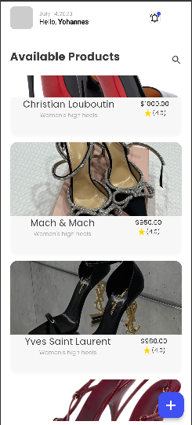
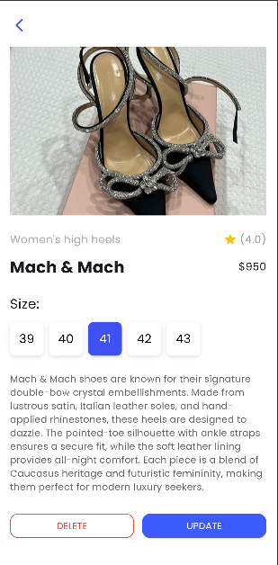
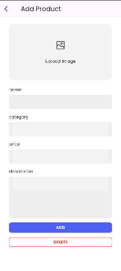

# :iphone: Flutter E-Commerce App (Clean Architecture)

A well-organized and modern E-Commerce product management application developed with Flutter, following Clean Architecture principles. It allows users to browse, add, edit, and remove products through a user-friendly interface enhanced with smooth animations.

---

## :fleur_de_lis: Main Features

- 📦 Browse all listed products 
- ✏️ Modify information of existing products
- 🔍 Access comprehensive product details, including size options 
- 🗑️ Delete products  
- ➕ Create new products with details like name, category, price, and description
 

---

## :building_construction: Architecture


```
lib/
├── core/                       # error,constances and other common 
├── features/
│   └── product/
│       ├── data/              # Data layer (models, datasources, repositories implementation)
│       ├── domain/            # Domain layer (entities, repository abstract classes, use cases)
│       └── presentation/      # Presentation layer (UI screens, widgets, blocs/cubits/providers)
|__ models                     # will be included under the presentation layer soon
|__ pages                      # will be included under the presentation layer soon
|__ widgets                    # will be included under the presentation layer soon
└── main.dart                  # App entry point and routing
```

---

## 📂 Test folder Structure

The `test/` directory mirrors the `lib/` structure for easy unit and widget testing:

```
test/
└── features/
    └── product/
        ├── data/
        ├── domain/
        └── presentation/
    └── fixtures
```

---
## :camera: Screenshots
## 📸 Screenshots

<table>
  <tr>
    <th>🏠 Home Page</th>
    <th>📄 Detail Page</th>
    <th>➕ Update Page</th>
    <th>🔍 Search Page</th>
  </tr>
  <tr>
    <td></td>
    <td></td>
    <td></td>
    <td></td>
  </tr>
</table>


## 🚀 Getting Started

### ✅ Prerequisites

- Flutter SDK: Install Flutter  
- IDE: VS Code / Android Studio  
- Android/iOS emulator or real device  

### 🛠️ Installation

Clone the repository and run the app:

```bash
# Clone this repository
git clone https://github.com/hanabif/2025-project-phase-mobile-tasks/tree/main/mobile/haymanot_aweke

# Go into the project folder
cd mobile
cd haymanot_aweke

# Install dependencies
flutter pub get

# Run the app
flutter run
```

---

## ✅ Testing

Run all tests:

```bash
flutter test
```

Test files are organized using the same structure as the `lib/` directory to ensure alignment and clarity.

---

## 🧩 Technologies Used

- 🧱 Flutter  
- 🗺 Clean Architecture  
- 💡 Provider  
- 🧪 flutter_test & mockito (for testing)  

---

## 🤝 Contributing

Feel free to open issues or submit pull requests. Contributions are welcome!
